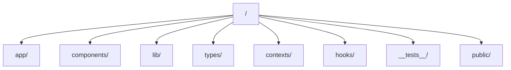

# Wikipedia To Learning Material

Convert Wikipedia articles to learning materials.

## Setup

### Prerequisites

- Node.js (v20+)
- npm

### Installation

1. Clone the repository:
   ```bash
   git clone https://github.com/tkysi-mi/Wikipedia-To-LearningMaterial.git
   cd Wikipedia-To-LearningMaterial
   ```

2. Install dependencies:
   ```bash
   npm install
   ```

### Development

Start the development server:

```bash
npm run dev
```

Open [http://localhost:3000](http://localhost:3000) with your browser to see the result.

### Testing & Linting

- Run tests: `npm run test`
- Run linting: `npm run lint`
- Build: `npm run build`

## Directory Structure



- `app/`: Next.js App Router pages and layouts
- `components/`: Reusable UI components
- `lib/`: Utility functions and libraries
- `types/`: TypeScript type definitions
- `contexts/`: React contexts
- `hooks/`: Custom React hooks
- `__tests__/`: Unit and integration tests
- `public/`: Static assets