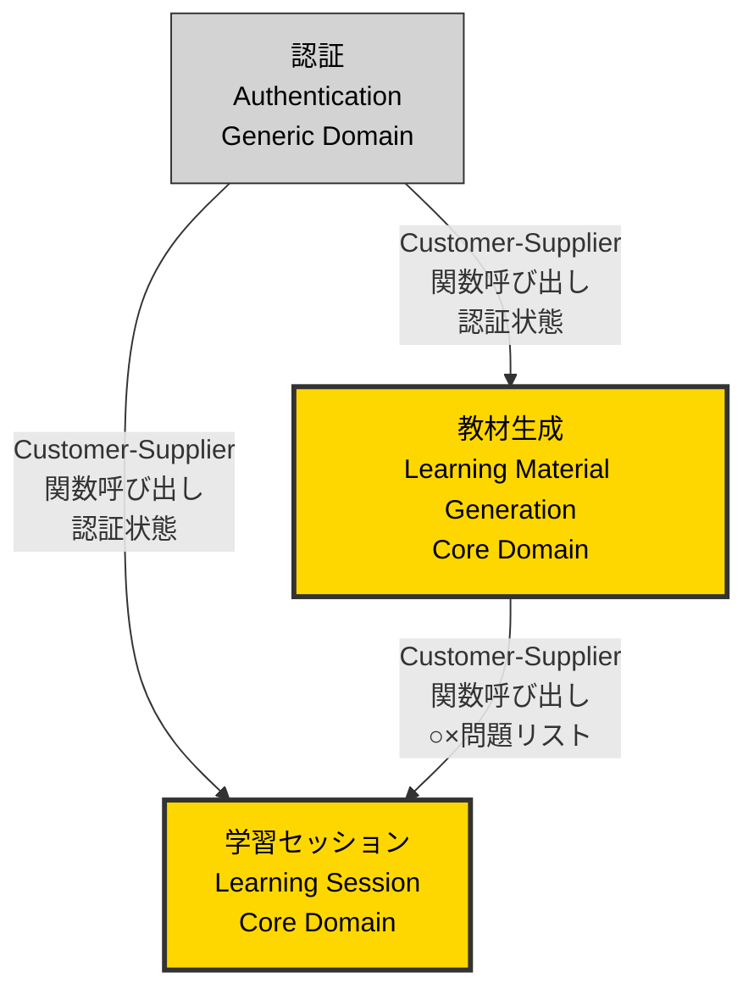
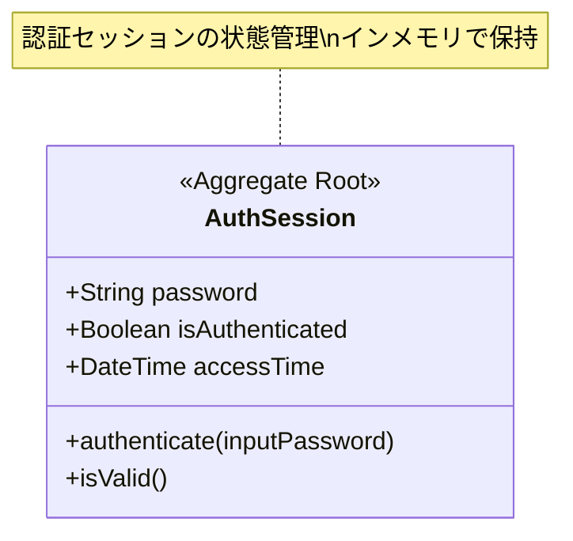
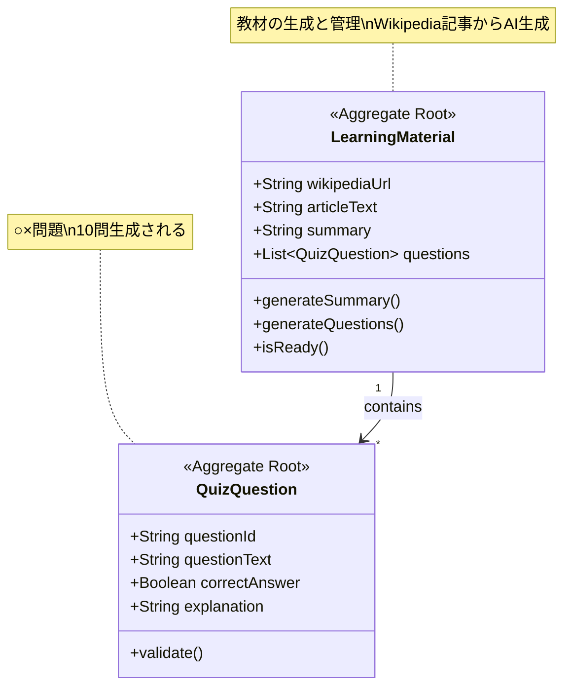
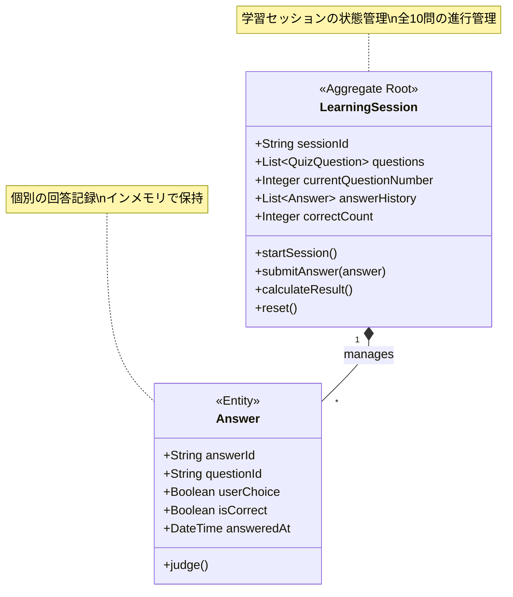

# ドメインモデル (Event Storming)

<!--
何を書くか: Event Storming形式でドメインモデルを記述したドキュメント

目的:
  - ビジネスドメインの境界（Bounded Context）を明確化
  - 各コンテキスト内のEvent Storming要素を体系的に整理
  - ドメイン間の関係性を可視化
  - チーム間の共通理解を構築

Event Storming形式とは:
  - Alberto Brandolini考案のドメインモデリング手法
  - Actors, Commands, Events, Policies, Aggregatesなどの要素で構成
  - 時系列に沿った業務フローの表現
  - 色分けされた要素分類（付箋の色に対応）

ドキュメント構成:
  1. 各Bounded Contextごとにセクションを分ける
  2. 各Context内でEvent Storming要素をリスト化
  3. 最後にContext Map（全体の関係図）を記述

更新頻度:
  - ドメインモデリング完了後に初版作成
  - スプリントレビュー時に見直し
  - 新しいBounded Contextや要素の発見時に追加
-->

---

## Bounded Context: 認証 (Authentication)

### 概要

**戦略的分類**: Generic Domain

**責務**:
ベーシック認証によるアクセス制御を提供し、不特定多数のアクセスを防止する。

**主要な責任**:
- パスワードによる認証
- アクセス権限の検証
- 認証セッションの管理

---

### Actors（アクター）

| アクター | 説明 |
|---------|------|
| システム管理者 | 認証設定を管理し、パスワードを設定する |
| 社会人（自習者） | パスワードを入力してアプリケーションにアクセスする |

---

### Commands（コマンド）

| コマンド | 発行者 | 説明 |
|---------|--------|------|
| パスワードを入力する | 社会人（自習者） | ベーシック認証のパスワードを入力する |
| 認証を検証する | システム | 入力されたパスワードが正しいか検証する |

---

### Domain Events（ドメインイベント）

| イベント | トリガー | 説明 |
|---------|---------|------|
| 認証成功 | パスワード検証成功 | パスワードが正しく、アクセスが許可された |
| 認証失敗 | パスワード検証失敗 | パスワードが誤っており、アクセスが拒否された |

---

### Policies（ポリシー）

| ポリシー | 条件 | アクション | 説明 |
|---------|------|-----------|------|
| アクセス制御 | Whenever 認証成功 | Then URL入力画面を表示する | 認証成功後、アプリケーションへのアクセスを許可 |
| アクセス拒否 | Whenever 認証失敗 | Then 認証エラーメッセージを表示する | 認証失敗時、再度パスワード入力を促す |

---

### Aggregates（集約）

| Aggregate | 責務 | 含まれるエンティティ |
|-----------|------|-------------------|
| AuthSession | 認証セッションの状態管理 | パスワード、認証状態、アクセス時刻 |

---

### Read Models（読み取りモデル）

| Read Model | 表示データ | 利用者 |
|-----------|-----------|--------|
| 認証画面 | パスワード入力フィールド、エラーメッセージ | 社会人（自習者） |

---

### External Systems（外部システム）

なし（環境変数からパスワードを取得）

---

## Bounded Context: 教材生成 (Learning Material Generation)

### 概要

**戦略的分類**: Core Domain

**責務**:
Wikipedia記事を解析し、AIを使用してサマリと○×問題を自動生成する。

**主要な責任**:
- Wikipedia記事の取得
- AIによるサマリ生成（3行程度）
- AIによる○×問題生成（10問）
- 生成エラーのハンドリング

---

### Actors（アクター）

| アクター | 説明 |
|---------|------|
| 社会人（自習者） | Wikipedia URLを入力し、教材生成を依頼する |
| Wikipedia API | Wikipedia記事のテキストを提供する |
| OpenAI API | サマリと○×問題を生成する |

---

### Commands（コマンド）

| コマンド | 発行者 | 説明 |
|---------|--------|------|
| Wikipedia URLを入力する | 社会人（自習者） | 学習したい記事のURLを指定する |
| URLを検証する | システム | 入力されたURLが有効なWikipedia URLか確認する |
| 記事を取得する | システム | Wikipedia APIから記事のテキストを取得する |
| サマリを生成する | システム | OpenAI APIで記事を3行に要約する |
| ○×問題を生成する | システム | OpenAI APIで記事から10問の○×問題を生成する |

---

### Domain Events（ドメインイベント）

| イベント | トリガー | 説明 |
|---------|---------|------|
| URL入力完了 | Wikipedia URLを入力 | 有効なWikipedia URLが送信された |
| URL検証エラー | URLを検証 | 無効なURL、または空のURLが送信された |
| 記事取得成功 | 記事を取得 | Wikipedia APIから記事テキストが正常に取得された |
| 記事取得失敗 | 記事を取得 | Wikipedia APIの呼び出しが失敗した |
| サマリ生成成功 | サマリを生成 | 3行のサマリが正常に生成された |
| サマリ生成失敗 | サマリを生成 | OpenAI APIの呼び出しが失敗した |
| 問題生成成功 | ○×問題を生成 | 10問の○×問題が正常に生成された |
| 問題生成失敗 | ○×問題を生成 | OpenAI APIの呼び出しが失敗した |

---

### Policies（ポリシー）

| ポリシー | 条件 | アクション | 説明 |
|---------|------|-----------|------|
| 自動記事取得 | Whenever URL入力完了 | Then 記事を取得する | 有効なURLが入力されたら、自動的に記事を取得 |
| 自動サマリ生成 | Whenever 記事取得成功 | Then サマリを生成する | 記事が取得できたら、自動的にサマリを生成 |
| エラー通知 | Whenever 記事取得失敗 | Then エラーメッセージを表示する | API失敗時、ユーザーに通知 |
| エラー通知 | Whenever サマリ生成失敗 | Then エラーメッセージを表示する | AI生成失敗時、ユーザーに通知 |

---

### Aggregates（集約）

| Aggregate | 責務 | 含まれるエンティティ |
|-----------|------|-------------------|
| LearningMaterial | 教材の生成と管理 | Wikipedia URL, 記事テキスト, サマリ, 問題リスト |
| QuizQuestion | ○×問題の管理 | 問題文, 正解（○/×）, 解説 |

---

### Read Models（読み取りモデル）

| Read Model | 表示データ | 利用者 |
|-----------|-----------|--------|
| URL入力画面 | URL入力フィールド、送信ボタン、エラーメッセージ | 社会人（自習者） |
| サマリ表示画面 | 3行サマリ、「問題を開始」ボタン | 社会人（自習者） |

---

### External Systems（外部システム）

| システム名 | 連携方法 | 目的 |
|-----------|---------|------|
| Wikipedia API | REST API (JSON) | 記事のテキストを取得 |
| OpenAI API | REST API (JSON) | サマリと○×問題を生成 |

---

## Bounded Context: 学習セッション (Learning Session)

### 概要

**戦略的分類**: Core Domain

**責務**:
○×問題の回答管理、正解/不正解フィードバック、結果集計を行い、学習体験を提供する。

**主要な責任**:
- 問題の順次表示
- ユーザー回答の記録
- 正解/不正解の判定
- 正答数と正答率の計算
- 学習セッションのリセット

---

### Actors（アクター）

| アクター | 説明 |
|---------|------|
| 社会人（自習者） | ○×問題に回答し、学習を進める |

---

### Commands（コマンド）

| コマンド | 発行者 | 説明 |
|---------|--------|------|
| 問題を開始する | 社会人（自習者） | サマリ表示画面から問題回答モードに移行する |
| ○を選択する | 社会人（自習者） | 現在の問題に対して○と回答する |
| ×を選択する | 社会人（自習者） | 現在の問題に対して×と回答する |
| 次の問題へ進む | 社会人（自習者） | フィードバック表示後、次の問題へ移動する |
| 結果を表示する | システム | 全10問終了後、正答数と正答率を計算して表示する |
| 学習をリセットする | 社会人（自習者） | 結果画面から新しい記事で再学習を開始する |

---

### Domain Events（ドメインイベント）

| イベント | トリガー | 説明 |
|---------|---------|------|
| 学習セッション開始 | 問題を開始 | 1問目が表示され、学習セッションが開始された |
| 回答送信完了 | ○/×を選択 | ユーザーの回答が記録された |
| 正解判定完了 | 回答送信完了 | 正解/不正解が判定され、フィードバックが表示された |
| 次の問題表示 | 次の問題へ進む | 次の問題が表示された（問題番号が更新） |
| 全問回答完了 | 10問目の回答送信 | すべての問題に回答し、結果計算の準備が整った |
| 結果計算完了 | 全問回答完了 | 正答数と正答率が計算され、結果画面が表示された |
| 学習セッションリセット | 学習をリセット | 前回のデータがクリアされ、URL入力画面に戻った |

---

### Policies（ポリシー）

| ポリシー | 条件 | アクション | 説明 |
|---------|------|-----------|------|
| 自動フィードバック表示 | Whenever 回答送信完了 | Then 正解判定完了 | 回答後、即座に正解/不正解を表示 |
| 自動結果表示 | Whenever 全問回答完了 | Then 結果を表示する | 10問目の回答後、自動的に結果画面へ遷移 |
| セッションクリア | Whenever 学習セッションリセット | Then 過去のデータを削除する | 再学習時、前回のデータをすべて削除 |

---

### Aggregates（集約）

| Aggregate | 責務 | 含まれるエンティティ |
|-----------|------|-------------------|
| LearningSession | 学習セッションの状態管理 | 問題リスト、現在の問題番号、回答履歴、正答数 |
| Answer | 個別の回答記録 | 問題ID、ユーザー回答（○/×）、正解判定、回答時刻 |

---

### Read Models（読み取りモデル）

| Read Model | 表示データ | 利用者 |
|-----------|-----------|--------|
| 問題回答画面 | 問題文、現在の問題番号（1/10, 2/10...）、○/×ボタン | 社会人（自習者） |
| フィードバック画面 | 正解/不正解メッセージ、正しい答え、「次へ」ボタン | 社会人（自習者） |
| 結果画面 | 正答数、正答率、「別の記事で試す」ボタン | 社会人（自習者） |

---

### External Systems（外部システム）

なし

---

## Context Map（コンテキスト間の関係）

| 上流Context | 下流Context | 関係パターン | 通信方法 | やり取りされるデータ |
|------------|------------|------------|---------|-------------------|
| 認証 | 教材生成 | Customer-Supplier | 関数呼び出し | 認証状態（成功/失敗） |
| 認証 | 学習セッション | Customer-Supplier | 関数呼び出し | 認証状態（成功/失敗） |
| 教材生成 | 学習セッション | Customer-Supplier | 関数呼び出し | 生成された○×問題リスト |

### Context Map 図

### Context間の依存関係

| 関係 | 説明 |
|------|------|
| 認証 → 教材生成 | 認証成功後、教材生成コンテキストがアクセス可能になる |
| 認証 → 学習セッション | 認証成功後、学習セッションコンテキストがアクセス可能になる |
| 教材生成 → 学習セッション | 生成された○×問題リストが学習セッションに渡される |

---

## Aggregate構造図

### 認証コンテキスト: AuthSession Aggregate

### 教材生成コンテキスト: LearningMaterial & QuizQuestion Aggregates

### 学習セッションコンテキスト: LearningSession & Answer Aggregates

---

## メモ

### Event Storming実施状況

- **実施日**: 2025-11-22
- **参加者**: AI（ドメインモデリング支援）
- **Bounded Context数**: 3
- **Aggregate数**: 5
- **Domain Event数**: 16

### 今後の課題

- 各Aggregateの詳細設計（属性、メソッド）
- Repositoryパターンの適用
- Data Modelへのマッピング（`/a-010-DefineDataModel` で実施）
- API仕様への変換（`/a-011-DefineAPISpec` で実施）

### ドメインモデルの特徴

このプロジェクトはデモ用途であり、データの永続化を行わないため、以下の特徴があります：

- **インメモリ管理**: すべてのAggregateはセッション内でのみ保持
- **Repository不要**: データベースを使用しないため、Repositoryパターンは簡略化
- **シンプルな境界**: 3つのBounded Contextで明確に分離され、依存関係も単純
