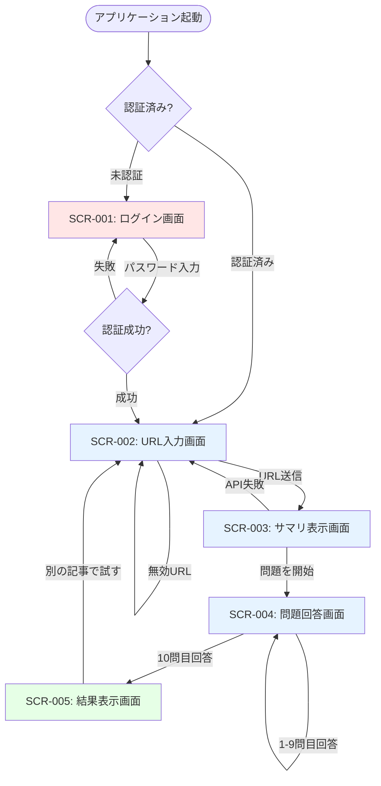

# 画面設計

<!--
何を書くか: アプリケーションの画面一覧、画面遷移フロー、レスポンシブデザインポリシー

目的:
  - ユーザー体験（UX）の設計と可視化
  - 画面間の導線を明確化
  - デザイナー・開発者・QAの共通理解を構築
  - 抜け漏れ防止（Empty State、エラー状態の考慮）
  - レスポンシブ対応方針の明確化

重要性:
  - 実装前にUXの問題を発見・修正
  - 画面遷移の複雑さを可視化し、シンプル化を検討
  - デッドエンド（戻れない画面）や循環参照を防止
  - モバイル・タブレット・デスクトップの対応方針を統一

記載のポイント:
  - 画面一覧（ID、名称、URLパス、権限、役割）
  - 画面遷移図（Mermaid flowchart）
  - 各画面の状態（Empty State、Loading、Error含む）
  - レスポンシブデザインのブレークポイントと対応方針

更新頻度:
  - プロジェクト初期に作成
  - 新しい画面追加時に更新
  - 画面遷移の変更時に更新
-->

---

## プロジェクト方針

**タイプ**: デモアプリケーション（学習教材生成）  
**重視点**: シンプルさ、直感的なフロー、最小限の画面数  
**画面数**: 5画面（コア機能のみ）

### 設計原則
- **直線的フロー**: ログイン → URL入力 → サマリ → ○×問題 → 結果 → URL入力（ループ）
- **ステートレス**: 前の画面に戻る必要なし（常に前進）
- **Empty State最小化**: データなし状態は考慮不要（常にURLから生成）
- **エラー処理**: インラインエラー表示（専用エラーページなし）

---

## 画面一覧

| 画面ID | カテゴリ | 画面名 | URLパス | アクセス権限 | 主な役割 |
|--------|---------|--------|---------|-------------|----------|
| SCR-001 | 認証 | ログイン画面 | `/login` | 未認証のみ | ベーシック認証（パスワード入力） |
| SCR-002 | メイン | URL入力画面（ホーム） | `/` | 認証済み | Wikipedia URL入力、学習開始 |
| SCR-003 | メイン | サマリ表示画面 | `/summary` | 認証済み | AI生成サマリ表示、問題開始ボタン |
| SCR-004 | メイン | 問題回答画面 | `/quiz` | 認証済み | ○×問題回答（1問ずつ、全10問） |
| SCR-005 | メイン | 結果表示画面 | `/results` | 認証済み | 正答数・正答率表示、再学習ボタン |

---

## 画面遷移図

### メインフロー

### 補足説明

| 遷移 | 条件・アクション |
|------|-----------------|
| 起動 → ログイン | 未認証の場合、自動的にログイン画面へリダイレクト |
| 起動 → URL入力 | 認証済みの場合、ホームページへ |
| ログイン → URL入力 | 正しいパスワード入力で認証成功 |
| ログイン → ログイン | 誤ったパスワードでエラー表示、再入力 |
| URL入力 → サマリ | 有効なWikipedia URL送信でサマリ生成開始 |
| URL入力 → URL入力 | 無効URLでエラー表示、再入力 |
| サマリ → 問題回答 | 「問題を開始」ボタンクリック |
| サマリ → URL入力 | API失敗時、URL入力画面に戻る |
| 問題回答 → 問題回答 | 1-9問目: 回答後「次へ」ボタンで次の問題へ |
| 問題回答 → 結果 | 10問目: 回答後、自動的に結果画面へ遷移 |
| 結果 → URL入力 | 「別の記事で試す」ボタンで新規学習開始 |

---

## 各画面の詳細

### SCR-001: ログイン画面

**URLパス**: `/login`  
**アクセス権限**: 未認証ユーザーのみ（認証済みの場合は`/`へリダイレクト）

#### 役割
ベーシック認証によるパスワード入力。不正アクセス防止（OpenAI API課金保護）。

#### 主要コンポーネント
- パスワード入力フィールド（type="password"）
- ログインボタン
- エラーメッセージ表示エリア

#### 画面状態

| 状態 | 説明 | 表示内容 |
|------|------|---------|
| 初期表示 | ページ読み込み直後 | パスワードフィールド + ログインボタン |
| 認証中 | ログインボタンクリック後 | ローディングスピナー + ボタン無効化 |
| 認証失敗 | 誤ったパスワード | エラーメッセージ「パスワードが正しくありません」（赤色） |
| 認証成功 | 正しいパスワード | `/`へリダイレクト（画面遷移） |

#### レイアウト
- 中央配置カード
- シンプルなフォーム（パスワード1フィールドのみ）
- ロゴ・タイトル表示（オプション）

---

### SCR-002: URL入力画面（ホーム）

**URLパス**: `/`  
**アクセス権限**: 認証済みユーザー（未認証の場合は`/login`へリダイレクト）

#### 役割
Wikipedia記事のURLを入力し、学習教材生成を開始する。アプリケーションのエントリーポイント。

#### 主要コンポーネント
- Wikipedia URL入力フィールド（type="url"）
- 送信ボタン（「教材を生成」など）
- エラーメッセージ表示エリア
- 使い方の簡単な説明（オプション）

#### 画面状態

| 状態 | 説明 | 表示内容 |
|------|------|---------|
| 初期表示 | ページ読み込み直後 | URL入力フィールド + 送信ボタン |
| 入力中 | URL入力中 | リアルタイムバリデーション（オプション） |
| 送信中 | 送信ボタンクリック後 | ローディングスピナー + ボタン無効化 |
| バリデーションエラー | 無効URL | エラーメッセージ「有効なWikipedia URLを入力してください」 |
| 空欄エラー | 空のURL送信 | エラーメッセージ「URLを入力してください」 |
| 送信成功 | 有効URL送信 | `/summary`へ遷移（サマリ生成開始） |

#### レイアウト
- 中央配置フォーム
- 目立つ入力フィールド（幅広）
- プレースホルダー例: `https://ja.wikipedia.org/wiki/人工知能`

---

### SCR-003: サマリ表示画面

**URLパス**: `/summary`  
**アクセス権限**: 認証済みユーザー

#### 役割
Wikipedia記事からAI生成された3行サマリを表示し、学習価値があるか判断させる。問題開始へ誘導。

#### 主要コンポーネント
- 記事タイトル表示
- AI生成サマリ（3行程度のテキスト）
- 「問題を開始」ボタン
- エラーメッセージ表示エリア
- 「別のURLで試す」リンク（オプション）

#### 画面状態

| 状態 | 説明 | 表示内容 |
|------|------|---------|
| 生成中（Loading） | Wikipedia API + OpenAI API呼び出し中 | ローディングスピナー + 「サマリを生成中...」メッセージ |
| 生成成功 | サマリ生成完了 | 記事タイトル + サマリテキスト + 「問題を開始」ボタン |
| API失敗（Error） | Wikipedia APIまたはOpenAI API失敗 | エラーメッセージ + 「戻る」ボタン（`/`へ） |

#### 生成中の詳細
- 想定時間: 10-30秒
- 進捗表示: スケルトンスクリーンまたはスピナー
- ユーザーへのメッセージ: 「記事を取得中...」→「サマリを生成中...」（段階表示）

#### レイアウト
- カード形式
- サマリは読みやすいフォントサイズ（16-18px推奨）
- 「問題を開始」ボタンは目立つ配置（中央またはサマリ下部）

---

### SCR-004: 問題回答画面

**URLパス**: `/quiz`  
**アクセス権限**: 認証済みユーザー

#### 役割
AI生成された○×問題を1問ずつ表示し、回答後に即座にフィードバックを提供。全10問を順番に回答。

#### 主要コンポーネント
- 問題番号表示（例: 「1/10」）
- 問題文（○×問題のテキスト）
- ○ボタン
- ×ボタン
- フィードバック表示エリア（正解/不正解 + 解説）
- 「次へ」ボタン（フィードバック後のみ表示）

#### 画面状態

| 状態 | 説明 | 表示内容 |
|------|------|---------|
| 生成中（Loading） | OpenAI API呼び出し中 | ローディングスピナー + 「問題を生成中...」メッセージ |
| 問題表示 | 問題生成完了、回答待ち | 問題番号 + 問題文 + ○×ボタン |
| 回答後（正解） | ○または×選択後、正解の場合 | 「正解！」メッセージ（緑色） + 解説（オプション） + 「次へ」ボタン |
| 回答後（不正解） | ○または×選択後、不正解の場合 | 「不正解」メッセージ（赤色） + 「正解は○（または×）です」 + 「次へ」ボタン |
| 最終問題回答後 | 10問目の回答後 | 自動的に`/results`へ遷移（または「結果を見る」ボタン） |

#### 生成中の詳細
- 想定時間: 30-60秒（最初の1回のみ）
- 進捗表示: スピナー + メッセージ

#### レイアウト
- カード形式
- ○×ボタンは大きく、タップしやすく（モバイル対応）
- フィードバックは視覚的に明確（色分け: 緑 = 正解、赤 = 不正解）
- 問題番号は常に表示（進捗把握）

---

### SCR-005: 結果表示画面

**URLパス**: `/results`  
**アクセス権限**: 認証済みユーザー

#### 役割
全10問の回答後、正答数と正答率を表示し、達成感を提供。再学習へ誘導。

#### 主要コンポーネント
- 正答数表示（例: 「7問正解」）
- 正答率表示（例: 「正答率: 70%」）
- 達成度メッセージ（全問正解時: おめでとうメッセージ、低正答率時: 励ましメッセージ）
- 「別の記事で試す」ボタン
- 問題の詳細（オプション: 各問の正誤一覧）

#### 画面状態

| 状態 | 説明 | 表示内容 |
|------|------|---------|
| 通常（正答率50%以上） | 正答数・正答率表示 | 正答数 + 正答率 + 「別の記事で試す」ボタン |
| 全問正解（100%） | 10問すべて正解 | おめでとうメッセージ（例: 「完璧です！🎉」） + 正答数・正答率 |
| 低正答率（50%未満） | 半分以下の正解 | 励ましメッセージ（例: 「もう一度挑戦しましょう！」） + 正答数・正答率 |
| 全問不正解（0%） | 1問も正解しなかった | 励ましメッセージ + 正答数・正答率 |

#### Empty State
- なし（必ず10問回答後にのみ到達）

#### レイアウト
- カード形式
- 正答数・正答率は大きく目立つフォント
- 達成度メッセージは感情的に訴える（絵文字使用推奨）
- 「別の記事で試す」ボタンは目立つ配置

---

## レスポンシブデザインポリシー

### ブレークポイント（Tailwind CSSデフォルト）

| ブレークポイント | 画面幅 | 対象デバイス | 対応優先度 |
|----------------|--------|------------|------------|
| **xs** (デフォルト) | `< 640px` | スマートフォン（縦） | 必須 |
| **sm** | `≥ 640px` | スマートフォン（横） | 必須 |
| **md** | `≥ 768px` | タブレット | 推奨 |
| **lg** | `≥ 1024px` | ノートPC | 推奨 |
| **xl** | `≥ 1280px` | デスクトップ | 推奨 |

### デザイン戦略
**モバイルファースト**: 最小画面（スマートフォン）から設計し、徐々に大画面に対応

### デバイス対応方針

| デバイスカテゴリ | 対応優先度 | 画面幅範囲 | 備考 |
|----------------|-----------|-----------|------|
| スマートフォン | **必須** | 320px - 640px | 主要ターゲット（社会人の移動中学習） |
| タブレット | **推奨** | 640px - 1024px | 自宅学習で使用 |
| ノートPC / デスクトップ | **推奨** | 1024px 以上 | オフィスや自宅での学習 |

### レイアウトパターン

#### ナビゲーション
- **ヘッダーなし** - デモのため、シンプルな画面遷移のみ
- **パンくずリストなし** - 直線的フローのため不要

#### コンテンツ配置

**スマートフォン（xs, sm）**:
- 単一カラム
- フォーム要素は画面幅いっぱい
- ボタンは大きく、タップしやすく（最小44x44px推奨）

**タブレット（md）**:
- 単一カラム（中央寄せ、max-width: 768px）
- 余白を増やして読みやすく

**デスクトップ（lg, xl）**:
- 単一カラム（中央寄せ、max-width: 1024px）
- カード形式で余白を活用

#### フォント・スペーシング

| 要素 | xs（モバイル） | md以上（タブレット・PC） |
|------|---------------|------------------------|
| 見出し（h1） | 24px | 32px |
| 見出し（h2） | 20px | 24px |
| 本文 | 16px | 18px |
| ボタンテキスト | 16px | 18px |
| 余白（padding） | 16px | 24px |

### タッチ対応

- **タップ対象サイズ**: 最小44x44px（iOS Human Interface Guidelines準拠）
- **ボタン間の間隔**: 最小8px（誤タップ防止）
- **キーボード表示対応**: input要素フォーカス時、画面スクロール調整

---

## アクセシビリティ方針

**目標**: WCAG 2.1 Level A準拠（デモのため、AAは目指さない）

### 主要な考慮事項
- **色のコントラスト**: 最小4.5:1（テキストと背景）
- **キーボード操作**: すべてのインタラクティブ要素にTabキーでアクセス可能
- **フォーカス表示**: フォーカス時の視覚的フィードバック（アウトライン）
- **エラーメッセージ**: 視覚的（色）だけでなく、テキストでも明示

---

## デザインシステム（最小限）

### カラーパレット

| 用途 | カラー | Tailwind Class |
|------|--------|---------------|
| プライマリ | 青系 | `bg-blue-600`, `text-blue-600` |
| 成功（正解） | 緑系 | `bg-green-600`, `text-green-600` |
| エラー（不正解） | 赤系 | `bg-red-600`, `text-red-600` |
| 背景 | グレー系 | `bg-gray-100` |
| テキスト | ダークグレー | `text-gray-900` |

### コンポーネント（shadcn/ui使用）

- **Button**: プライマリボタン、セカンダリボタン
- **Input**: テキスト入力、URL入力、パスワード入力
- **Card**: コンテンツカード
- **Alert**: エラーメッセージ、成功メッセージ

---

## 今後の拡張性

将来的に機能が増えた場合の画面追加候補：

| 拡張機能 | 追加画面 |
|---------|---------|
| ユーザー管理 | サインアップ画面、プロフィール画面 |
| 学習履歴 | 履歴一覧画面、詳細履歴画面 |
| 難易度選択 | 設定画面 |
| 他の知識ソース | ソース選択画面 |

---

## メモ

### 変更履歴
- 2025-11-22: 初版作成（5画面のシンプル構成）

### 次のアクション
1. Figma/Sketchでワイヤーフレーム作成（オプション）
2. shadcn/uiコンポーネント選定・カスタマイズ
3. ページコンポーネント実装（`app/`配下）
4. レスポンシブテスト（Chrome DevTools）

### 注意事項
- 本設計はデモ用途に最適化されており、詳細なUI仕様はコード実装時に決定
- デザインツール（Figma）は使用しない予定（開発速度優先）
- ユーザーテストは最小限（社内確認程度）
