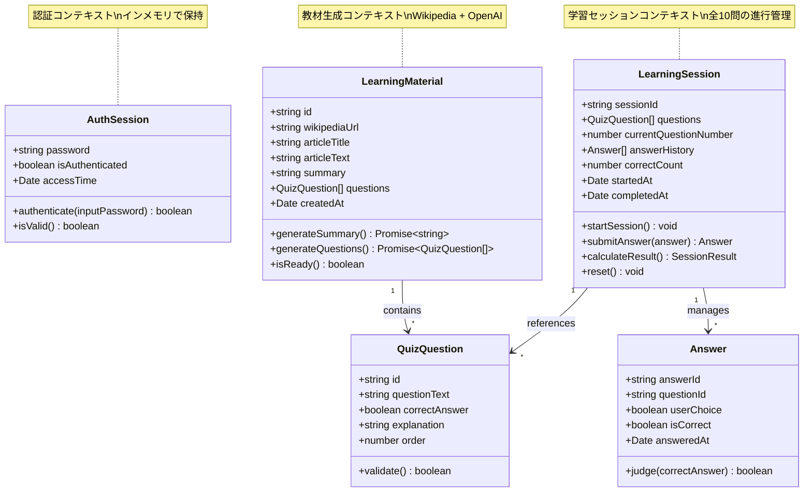
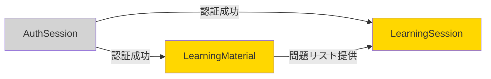

# データ構造ドキュメント

<!--
何を書くか: インメモリデータ構造の詳細仕様

目的:
  - TypeScript型定義の設計根拠を記録
  - ドメインモデルとコード実装の対応関係を明確化
  - バリデーションルールと制約条件を文書化
  - 開発者間の共通理解を構築

重要性:
  - データベースを使用しないため、型定義が唯一のデータ仕様
  - インメモリデータの整合性を保証するための設計指針
  - 将来のデータベース導入時の移行指針

更新頻度:
  - プロジェクト初期に作成
  - 型定義変更時に更新
  - ドメインモデル変更時に同期
-->

---

## プロジェクト方針

**データ永続化**: なし（インメモリのみ）  
**型安全性**: TypeScriptで厳密な型定義  
**ドメイン駆動**: ドメインモデルのAggregatesを型定義にマッピング

### 設計原則
- **型安全性優先**: すべてのデータ構造をTypeScriptで型定義
- **ドメインモデル準拠**: Aggregatesを忠実に型定義に変換
- **バリデーション明確化**: 制約条件をコメントとコードで明示
- **シンプル性**: データベース不要のため、複雑なリレーションシップは避ける

---

## Bounded Context別データ構造

### 認証コンテキスト (Authentication)

#### AuthSession

**責務**: 認証セッションの状態管理

**型定義の場所**: `src/types/auth.ts`

**属性**:

| 属性名 | 型 | 必須 | 説明 | 制約 |
|--------|-----|------|------|------|
| password | `string` | ✓ | 環境変数から取得したパスワード | 環境変数 `AUTH_PASSWORD` から取得 |
| isAuthenticated | `boolean` | ✓ | 認証状態 | `true`: 認証済み, `false`: 未認証 |
| accessTime | `Date` | ✓ | 最終アクセス日時 | 認証成功時に更新 |

**メソッド**:
- `authenticate(inputPassword: string): boolean` - パスワード検証
- `isValid(): boolean` - セッション有効性確認

**バリデーションルール**:
- `password`: 空文字列不可
- `accessTime`: 未来の日時不可

**ライフサイクル**:
- 作成: アプリケーション起動時
- 更新: 認証成功時
- 削除: セッション終了時（ブラウザクローズ）

---

### 教材生成コンテキスト (Learning Material Generation)

#### LearningMaterial

**責務**: Wikipedia記事から生成された教材の管理

**型定義の場所**: `src/types/learning-material.ts`

**属性**:

| 属性名 | 型 | 必須 | 説明 | 制約 |
|--------|-----|------|------|------|
| id | `string` | ✓ | 教材ID | UUID v4 |
| wikipediaUrl | `string` | ✓ | Wikipedia記事URL | 有効なWikipedia URL形式 |
| articleTitle | `string` | ✓ | 記事タイトル | Wikipedia APIから取得 |
| articleText | `string` | ✓ | 記事本文 | Wikipedia APIから取得 |
| summary | `string` | ✓ | AI生成サマリ | 3行程度（約100-200文字） |
| questions | `QuizQuestion[]` | ✓ | ○×問題リスト | 必ず10問 |
| createdAt | `Date` | ✓ | 生成日時 | 教材生成完了時 |

**メソッド**:
- `generateSummary(): Promise<string>` - OpenAI APIでサマリ生成
- `generateQuestions(): Promise<QuizQuestion[]>` - OpenAI APIで問題生成
- `isReady(): boolean` - 教材生成完了確認

**バリデーションルール**:
- `wikipediaUrl`: 正規表現 `^https://ja\.wikipedia\.org/wiki/.+$`
- `summary`: 最小50文字、最大500文字
- `questions`: 配列長さ必ず10
- `articleText`: 最小100文字

**ライフサイクル**:
- 作成: URL入力画面でURL送信時
- 更新: サマリ・問題生成完了時
- 削除: 新しい教材生成時（前回データ破棄）

---

#### QuizQuestion

**責務**: ○×問題の管理

**型定義の場所**: `src/types/learning-material.ts`

**属性**:

| 属性名 | 型 | 必須 | 説明 | 制約 |
|--------|-----|------|------|------|
| id | `string` | ✓ | 問題ID | UUID v4 |
| questionText | `string` | ✓ | 問題文 | 最小10文字、最大500文字 |
| correctAnswer | `boolean` | ✓ | 正解 | `true`: ○, `false`: × |
| explanation | `string` | - | 解説 | オプション（将来拡張用） |
| order | `number` | ✓ | 問題番号 | 1-10 |

**メソッド**:
- `validate(): boolean` - 問題データの妥当性確認

**バリデーションルール**:
- `questionText`: 空文字列不可、最小10文字
- `order`: 1以上10以下の整数
- `correctAnswer`: 必ず `true` または `false`

**ライフサイクル**:
- 作成: LearningMaterial生成時に10問一括生成
- 更新: なし（イミュータブル）
- 削除: LearningMaterial削除時

---

### 学習セッションコンテキスト (Learning Session)

#### LearningSession

**責務**: 学習セッションの状態管理（全10問の進行管理）

**型定義の場所**: `src/types/learning-session.ts`

**属性**:

| 属性名 | 型 | 必須 | 説明 | 制約 |
|--------|-----|------|------|------|
| sessionId | `string` | ✓ | セッションID | UUID v4 |
| questions | `QuizQuestion[]` | ✓ | 問題リスト | LearningMaterialから取得、10問 |
| currentQuestionNumber | `number` | ✓ | 現在の問題番号 | 1-10 |
| answerHistory | `Answer[]` | ✓ | 回答履歴 | 最大10件 |
| correctCount | `number` | ✓ | 正答数 | 0-10 |
| startedAt | `Date` | ✓ | セッション開始日時 | 問題開始ボタンクリック時 |
| completedAt | `Date \| null` | - | セッション完了日時 | 10問目回答時 |

**メソッド**:
- `startSession(): void` - セッション開始
- `submitAnswer(answer: boolean): Answer` - 回答送信
- `calculateResult(): SessionResult` - 結果計算
- `reset(): void` - セッションリセット

**バリデーションルール**:
- `currentQuestionNumber`: 1以上10以下
- `answerHistory`: 配列長さ0以上10以下
- `correctCount`: 0以上10以下
- `questions`: 配列長さ必ず10

**ライフサイクル**:
- 作成: 「問題を開始」ボタンクリック時
- 更新: 各問題回答時
- 削除: 「別の記事で試す」ボタンクリック時

---

#### Answer

**責務**: 個別の回答記録

**型定義の場所**: `src/types/learning-session.ts`

**属性**:

| 属性名 | 型 | 必須 | 説明 | 制約 |
|--------|-----|------|------|------|
| answerId | `string` | ✓ | 回答ID | UUID v4 |
| questionId | `string` | ✓ | 問題ID | QuizQuestion.id参照 |
| userChoice | `boolean` | ✓ | ユーザー回答 | `true`: ○, `false`: × |
| isCorrect | `boolean` | ✓ | 正解判定 | `true`: 正解, `false`: 不正解 |
| answeredAt | `Date` | ✓ | 回答日時 | 回答送信時 |

**メソッド**:
- `judge(correctAnswer: boolean): boolean` - 正解判定

**バリデーションルール**:
- `questionId`: 空文字列不可
- `answeredAt`: 未来の日時不可

**ライフサイクル**:
- 作成: ○または×ボタンクリック時
- 更新: なし（イミュータブル）
- 削除: LearningSession削除時

---

## 共通型定義

### 列挙型

**型定義の場所**: `src/types/common.ts`

#### QuizChoice

```typescript
type QuizChoice = true | false; // true: ○, false: ×
```

#### SessionStatus

```typescript
type SessionStatus = 'not_started' | 'in_progress' | 'completed';
```

---

## データ構造図

### 全体構造（Mermaid Class Diagram）



### Context間の関係



---

## バリデーション戦略

### クライアント側バリデーション

**実装場所**: React Hook Form + Zod

**対象**:
- URL入力フォーム: Wikipedia URL形式チェック
- パスワード入力: 空文字列チェック

### サーバー側バリデーション

**実装場所**: Next.js API Routes

**対象**:
- Wikipedia API呼び出し前: URL形式再検証
- OpenAI API呼び出し前: 記事テキスト長さチェック

### ドメインロジックバリデーション

**実装場所**: 各Aggregateのメソッド内

**対象**:
- LearningMaterial: 問題数が10問か確認
- LearningSession: 現在の問題番号が範囲内か確認
- Answer: 正解判定ロジック

---

## 制約条件まとめ

| データ構造 | 制約条件 |
|-----------|---------|
| AuthSession | パスワードは環境変数から取得、空文字列不可 |
| LearningMaterial | Wikipedia URL形式必須、問題数必ず10問 |
| QuizQuestion | 問題文最小10文字、問題番号1-10 |
| LearningSession | 問題数必ず10問、現在の問題番号1-10、正答数0-10 |
| Answer | 回答日時は未来不可 |

---

## インメモリ管理戦略

### データの保持場所

| データ構造 | 保持場所 | 保持期間 |
|-----------|---------|---------|
| AuthSession | サーバーメモリ（Next.js API Routes） | セッション中 |
| LearningMaterial | サーバーメモリ | 教材生成から学習完了まで |
| LearningSession | サーバーメモリ | 問題開始から結果表示まで |

### データクリア戦略

- **新規教材生成時**: 前回のLearningMaterialとLearningSessionを破棄
- **セッションタイムアウト**: 30分間操作なしでデータ破棄（将来実装）
- **ブラウザクローズ**: すべてのデータ破棄

---

## 将来の拡張性

### データベース導入時の移行指針

**対象テーブル**:
- `users`: ユーザー管理
- `learning_materials`: 教材の永続化
- `learning_sessions`: 学習履歴
- `answers`: 回答履歴

**マイグレーション戦略**:
1. 現在の型定義をPrismaスキーマに変換
2. リレーションシップを外部キーで実装
3. タイムスタンプカラム（`created_at`, `updated_at`）追加

---

## メモ

### 変更履歴
- 2025-11-22: 初版作成（インメモリデータ構造整理）

### 次のアクション
1. TypeScript型定義ファイル作成（`src/types/`配下）
2. Zodスキーマ定義（バリデーション用）
3. 型定義のユニットテスト作成

### 注意事項
- データベースを使用しないため、型定義が唯一のデータ仕様
- 将来のデータベース導入時は、このドキュメントを基にマイグレーション計画を立てる
