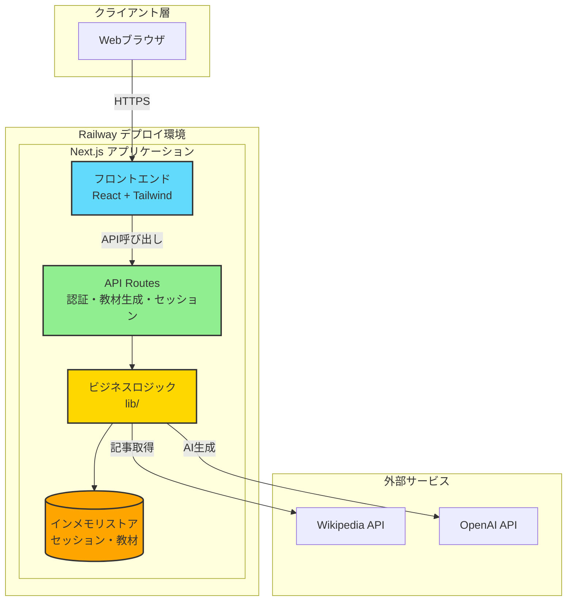
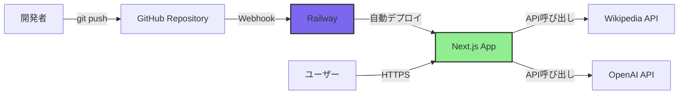
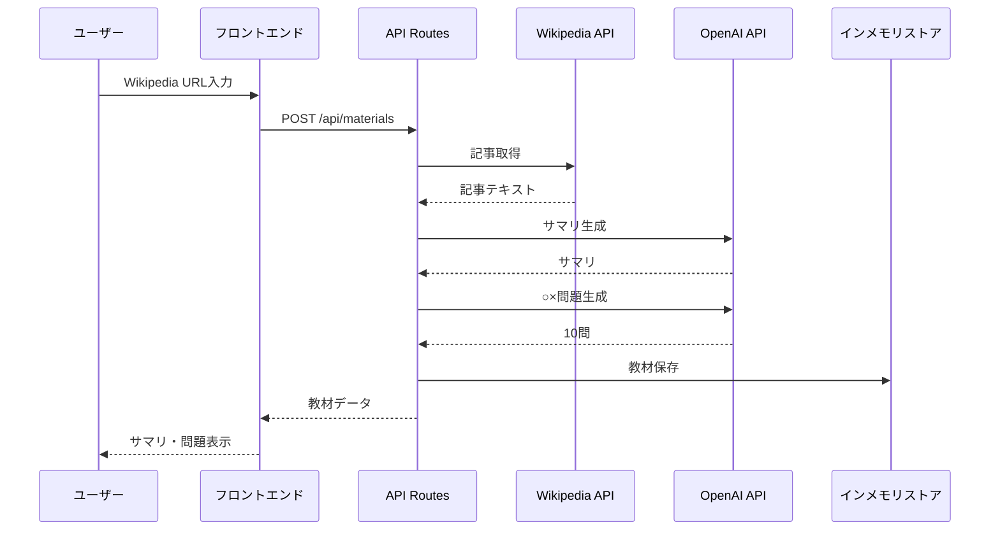
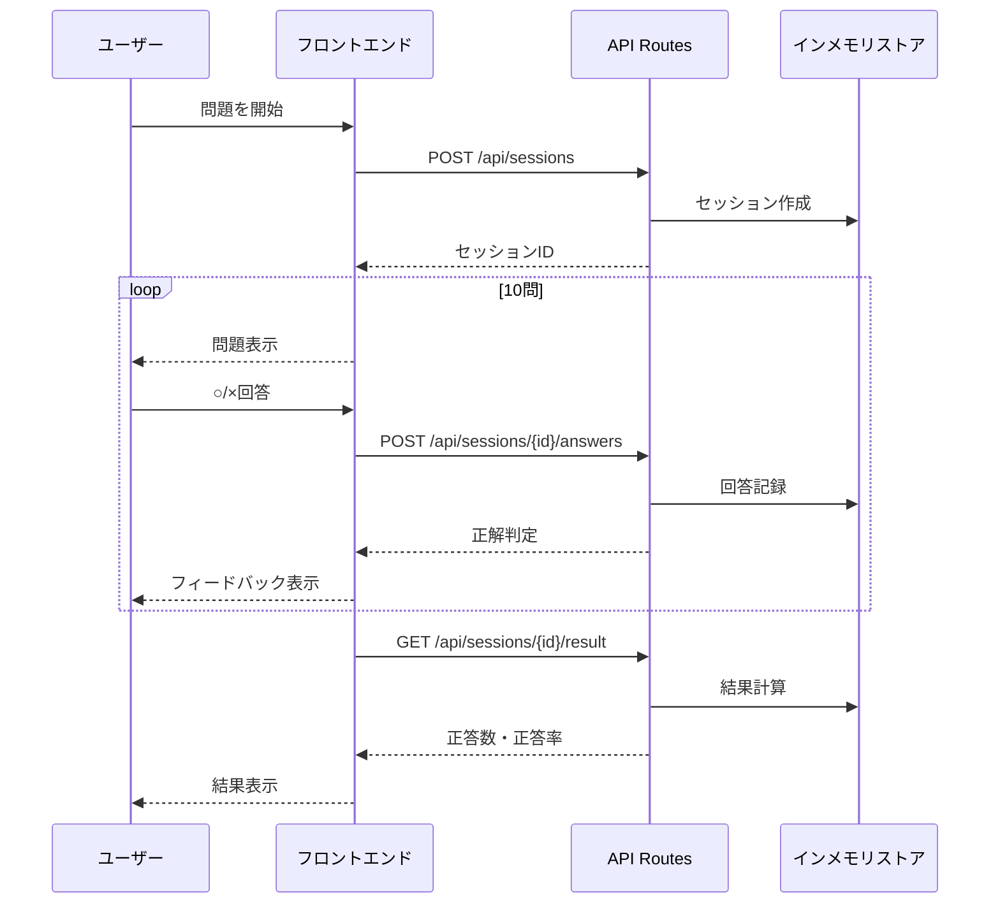

# システムアーキテクチャ

<!--
何を書くか: システム全体の構造、コンポーネント構成、アーキテクチャパターン、重要な技術的決定

目的:
  - システム全体の構造を可視化
  - コンポーネント間の関係性を明確化
  - アーキテクチャパターンの一貫性維持
  - 重要な技術的決定の記録(ADR)
  - 新規メンバーのオンボーディング支援

重要性:
  - システム全体の見通しを向上
  - 技術的決定の透明性確保
  - アーキテクチャの一貫性維持
  - 将来の拡張性を考慮した設計

記載のポイント:
  - 高レベルなアーキテクチャのみ記録(詳細は実装コードで管理)
  - Mermaid図で視覚化
  - ADRで重要な決定を記録
  - データフローを明確化

更新頻度:
  - プロジェクト初期に作成
  - アーキテクチャ変更時に更新
  - 重要な技術的決定時にADR追加
-->

---

## プロジェクト概要

**タイプ**: デモアプリケーション  
**構成**: Next.js統合(フロントエンド + バックエンド)  
**デプロイ**: Railway  
**データ**: インメモリのみ(永続化なし)  
**スケール**: 小規模(同時利用2-3人)

### アーキテクチャの目標

- **シンプルさ**: 最小構成で理解しやすいアーキテクチャ
- **低コスト**: 単一サービス、オープンソース技術優先
- **迅速な開発**: Next.jsの規約に従い、学習コスト最小化
- **保守性**: TypeScriptによる型安全性確保

### 制約条件

- データベース不使用(インメモリのみ)
- 同時接続2-3人想定
- 学習履歴の永続化なし
- デモ用途のため、高可用性・冗長化は考慮しない

---

## コンポーネント構成

### クライアント層

| コンポーネント | 説明 |
|--------------|------|
| Webブラウザ | Chrome/Firefox/Safari最新版 |

### プレゼンテーション層

| コンポーネント | バージョン | 説明 |
|--------------|-----------|------|
| Next.js | 14.x | フロントエンド+バックエンド統合、App Router |
| React | 18.x | UIコンポーネント |
| Tailwind CSS | 3.x | スタイリング |
| shadcn/ui | - | UIコンポーネントライブラリ |

### API層

| コンポーネント | バージョン | 説明 |
|--------------|-----------|------|
| Next.js API Routes | - | RESTful API |
| Node.js | 20.x LTS | ランタイム |

### ビジネスロジック層

| モジュール | 場所 | 責務 |
|-----------|------|------|
| 認証ロジック | `lib/auth/` | ベーシック認証、セッション管理 |
| 教材生成ロジック | `lib/openai/`, `lib/wikipedia/` | サマリ・問題生成、記事取得 |
| セッション管理 | `lib/session/` | 学習セッション状態管理 |
| ユーティリティ | `lib/utils/` | 汎用関数 |

### データ層

| コンポーネント | 説明 |
|--------------|------|
| インメモリストア | セッション・教材データをメモリで管理 |

### 外部サービス

| サービス | 用途 | 料金 |
|---------|------|------|
| Wikipedia API | 記事テキスト取得 | 無料 |
| OpenAI API | サマリ・○×問題生成 | 月額$10-50 |

### 開発・運用

| ツール | 用途 |
|--------|------|
| GitHub | ソースコード管理 |
| GitHub Actions | CI/CD(lint, test) |
| Railway | デプロイ・ホスティング |

---

## システムアーキテクチャ図

### 概要図



### 補足説明

- **クライアント層**: Webブラウザから HTTPS で Next.js アプリケーションにアクセス
- **プレゼンテーション層**: React + Tailwind CSS で UI を構築
- **API層**: Next.js API Routes で RESTful API を提供
- **ビジネスロジック層**: 認証、教材生成、セッション管理のロジックを実装
- **データ層**: インメモリストアでセッション・教材データを管理
- **外部サービス**: Wikipedia API で記事取得、OpenAI API でサマリ・問題生成

---

## 採用アーキテクチャパターン

### パターン名

**Next.js App Router標準構造 + 機能ベース (最小構成)**

### 選定理由

- **デモ用途**: 複雑なアーキテクチャパターン(クリーンアーキテクチャ、レイヤードアーキテクチャ)は過剰
- **学習コスト最小化**: Next.jsの規約に従う
- **機能ごとにモジュール化**: auth/, openai/, wikipedia/, session/ で明確に分離
- **データベース不使用**: Repository層・Domain層は不要

### 適用範囲

- **バックエンド全体**: lib/ 配下のすべてのモジュール
- **フロントエンド全体**: app/, components/ 配下

### 依存方向

```
app/             →  lib/ (ビジネスロジック)
app/             →  components/ (UIコンポーネント)
app/             →  types/ (型定義)
components/      →  types/
lib/             →  types/
hooks/           →  contexts/
hooks/           →  lib/
contexts/        →  lib/
```

### 禁止される依存

- ❌ `lib/` → `app/` (ビジネスロジックがページに依存するのはNG)
- ❌ `lib/` → `components/` (ビジネスロジックがUIに依存するのはNG)
- ❌ `components/` → `app/` (共通コンポーネントがページに依存するのはNG)

### アーキテクチャ原則

| 原則 | 説明 |
|------|------|
| **疎結合** | コンポーネント間の依存を最小化 |
| **高凝集** | 関連する機能を1つのモジュールにまとめる |
| **単一責任の原則** | 1つのクラス/モジュールは1つの責任のみ |
| **関心の分離** | UI、ビジネスロジック、データアクセスを分離 |
| **DRY** | 重複を避ける |
| **YAGNI** | 必要になるまで実装しない |

---

## デプロイ構成

### パターン

**シンプルなモノリス (Railway)**

### 構成



### デプロイフロー

1. 開発者が `git push` でコードをGitHubにプッシュ
2. Railwayが Webhook で変更を検知
3. Railwayが自動的にビルド・デプロイ
4. ユーザーが HTTPS でアプリケーションにアクセス

### 環境変数管理

| 環境変数 | 説明 | 管理場所 |
|---------|------|---------|
| `AUTH_PASSWORD` | ベーシック認証パスワード | Railway環境変数 |
| `OPENAI_API_KEY` | OpenAI APIキー | Railway環境変数 |
| `NEXT_PUBLIC_APP_URL` | アプリケーションURL | Railway環境変数 |

### スケーラビリティ

- **現状**: 単一インスタンス (2-3人同時接続で十分)
- **将来**: Railwayの水平スケール機能で対応可能

### 高可用性・冗長化

- **現状**: デモ用途のため、考慮しない
- **将来**: 複数インスタンス、データベースレプリケーション検討

---

## データフロー

### 教材生成フロー



### 学習セッションフロー



---

## ADR (Architecture Decision Record)

### ADR-001: Next.js統合構成の採用

**日付**: 2025-11-22

**ステータス**: 採用

**コンテキスト**:
- デモアプリケーションのため、シンプルさと低コストを重視
- フロントエンドとバックエンドを別々に構築すると複雑化

**決定**:
フロントエンド+バックエンドをNext.jsで統合

**理由**:
- 単一の `git push` で自動デプロイ
- フロントエンドとバックエンドで型定義を共有
- 低コスト (単一サービス $5-10/month)
- 学習コスト最小 (Next.jsの標準構造に従う)

**代替案**:
- Vite + Express: フロント・バック分離で複雑化、デモには過剰

**影響**:
- ✅ 開発速度向上
- ✅ コスト削減
- ✅ 保守性向上
- ⚠️ スケーラビリティは限定的 (将来的にマイクロサービス化が必要な場合は再設計)

---

### ADR-002: データベース不使用

**日付**: 2025-11-22

**ステータス**: 採用

**コンテキスト**:
- 要件で「学習履歴の永続化なし」と明記
- デモ用途のため、データベース管理コストを削減したい

**決定**:
インメモリのみ、永続化なし

**理由**:
- 要件で明示的に永続化不要
- インメモリで十分 (セッションごと1-5KB)
- コスト削減、構成のシンプル化

**代替案**:
- SQLite: ファイルベース、セットアップ不要 (却下: 要件外)
- PostgreSQL on Railway: Railwayサポート、スケーラビリティ (却下: コスト増)

**影響**:
- ✅ コスト削減
- ✅ 構成のシンプル化
- ⚠️ データ永続化が必要になった場合は再設計

---

### ADR-003: Railway採用

**日付**: 2025-11-22

**ステータス**: 採用

**コンテキスト**:
- 要件でRailwayが指定されている
- Git push自動デプロイが必要

**決定**:
Railwayでデプロイ

**理由**:
- 要件で指定
- Git push自動デプロイで迅速な開発サイクル
- 環境変数管理が簡単 (APIキー、パスワード)
- 月額$5-10で低コスト

**代替案**:
- Vercel: Next.jsに最適化 (却下: 要件で指定なし)
- AWS ECS: スケーラビリティ (却下: 過剰、コスト高)

**影響**:
- ✅ 迅速なデプロイ
- ✅ 低コスト
- ✅ 環境変数管理が簡単

---

### ADR-004: ベーシック認証

**日付**: 2025-11-22

**ステータス**: 採用

**コンテキスト**:
- デモ用途のため、シンプルな認証で十分
- 不特定多数のアクセスを防止したい

**決定**:
カスタム実装のベーシック認証

**理由**:
- デモ用途、シンプルな認証で十分
- ライブラリ不要、実装コスト低
- 環境変数でパスワード管理

**代替案**:
- Auth0/Clerk: 高機能な認証サービス (却下: 過剰、コスト増)
- NextAuth.js: Next.js向け認証ライブラリ (却下: デモには過剰)

**影響**:
- ✅ 実装コスト低
- ✅ シンプル
- ⚠️ セキュリティは限定的 (本番環境では不十分)

---

### ADR-005: TypeScript採用

**日付**: 2025-11-22

**ステータス**: 採用

**コンテキスト**:
- 型安全性を確保したい
- Next.jsとの親和性が高い

**決定**:
TypeScriptで型安全性確保

**理由**:
- 型安全性により開発効率向上、バグ削減
- Next.jsとの親和性が高い
- フロント・バック共通言語で学習コスト削減

**代替案**:
- JavaScript: 型エラーのリスク、保守性低下 (却下)

**影響**:
- ✅ 開発効率向上
- ✅ バグ削減
- ✅ 保守性向上

---

## セキュリティ

### 認証

| 項目 | 実装 |
|------|------|
| 認証方式 | ベーシック認証 (環境変数でパスワード管理) |
| セッション管理 | HttpOnly Cookie |
| パスワード保護 | 環境変数 `AUTH_PASSWORD` |

### API保護

| 項目 | 実装 |
|------|------|
| 認証ミドルウェア | 保護されたエンドポイントで認証チェック |
| CORS設定 | Next.js標準設定 |
| レート制限 | 将来実装検討 |

### 環境変数

| 項目 | 実装 |
|------|------|
| ローカル開発 | `.env.local` (gitignore) |
| 本番環境 | Railway環境変数管理 |
| APIキー保護 | サーバー側のみで使用、クライアントに露出しない |

### 外部API

| 項目 | 実装 |
|------|------|
| OpenAI APIキー | サーバー側のみで使用 |
| Wikipedia API | 公開API、認証不要 |

---

## 監視・ログ

### ログ

| 項目 | 実装 |
|------|------|
| ログ出力 | Railway Logs (標準出力) |
| エラーログ | console.error で記録 |
| アクセスログ | 将来実装検討 |

### 監視

| 項目 | 実装 |
|------|------|
| 基本監視 | Railway標準監視 |
| エラートラッキング | デモ用途のため、現時点では不要 |
| 将来検討 | Sentry導入検討 |

---

## 今後の拡張性

### データベース導入時

```
├── prisma/                 # Prisma ORM
│   ├── schema.prisma       # データベーススキーマ
│   └── migrations/         # マイグレーション
└── lib/
    └── db/                 # データベースクライアント
        └── client.ts
```

**マイグレーション戦略**:
1. 現在の型定義をPrismaスキーマに変換
2. リレーションシップを外部キーで実装
3. タイムスタンプカラム (`created_at`, `updated_at`) 追加

### 複雑化した場合 (レイヤードアーキテクチャ)

```
└── lib/
    ├── domain/             # ドメインモデル、ビジネスルール
    ├── application/        # ユースケース、アプリケーションロジック
    └── infrastructure/     # 外部API、永続化
```

### スケール要件変更時

- **水平スケール**: Railwayの複数インスタンス
- **データベース**: PostgreSQL on Railway
- **キャッシュ**: Redis導入
- **ロードバランサー**: Railwayの標準機能

---

## メモ

### 変更履歴
- 2025-11-22: 初版作成

### 次のアクション
1. 実装開始 (`/c-001-ImplementTask`)
2. アーキテクチャの妥当性検証
3. 将来の拡張性を考慮した設計レビュー

### 注意事項
- 本アーキテクチャはデモ用途に最適化されており、本番環境では追加の考慮が必要
- スケール要件が変わった場合は、アーキテクチャの見直しを検討
- データベース導入時は、このドキュメントを基にマイグレーション計画を立てる
