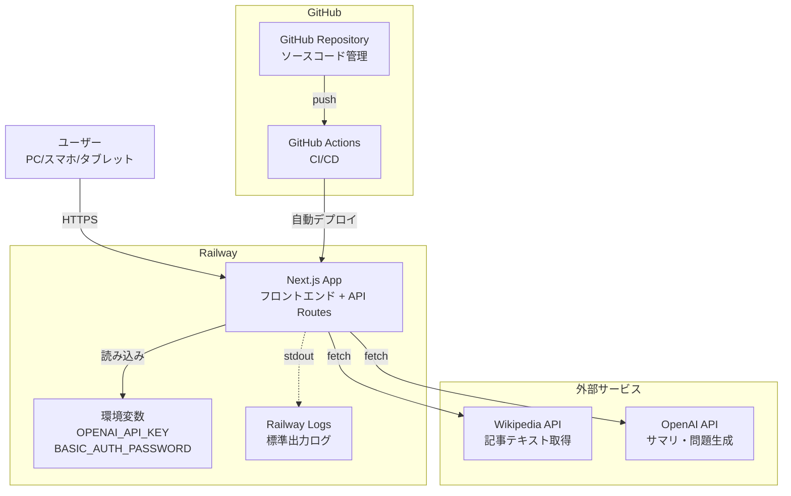
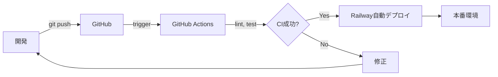

# インフラ設計

<!--
何を書くか: インフラ構成図、環境構成、主要な運用方針

目的:
  - インフラ構成の全体像を可視化
  - 環境ごとの違いを明確化
  - 基本的な運用方針の記録

重要性:
  - 高レベルなインフラ構成の全体像を把握
  - 詳細な実装（スペック、ネットワーク設定、監視設定）は Infrastructure as Code で管理

記載のポイント:
  - インフラ構成図で視覚的に表現（Multi-AZ構成など）
  - 環境ごとの違い（開発、ステージング、本番）
  - バックアップ・監視の基本方針

更新頻度:
  - プロジェクト初期にインフラ設計を作成
  - インフラ構成変更時に更新
-->

---

## プロジェクト方針

**タイプ**: デモアプリケーション
**インフラパターン**: PaaSのみ（最もシンプル）
**スケール**: 小規模（同時利用2-3人）
**データ永続化**: なし（インメモリのみ）

### 設計原則

- **最小構成**: PaaSのみで運用、インフラ管理不要
- **低コスト**: 月額$15-60（Railway + OpenAI API）
- **運用負荷最小**: 自動デプロイ、マネージド環境
- **シンプルさ優先**: VPC、ロードバランサー、データベース不要

---

## インフラ構成図

<!--
Mermaid を使用してインフラ全体の構成を可視化

記載のベストプラクティス:
  1. 物理的な構成を表現（サーバー、ネットワーク、ストレージ）
  2. 冗長化構成を明記（Multi-AZ、フェイルオーバー）
  3. ネットワークセグメントを分離（パブリック、プライベート、DMZ）
  4. セキュリティグループ、ファイアウォールルールを図示
  5. 外部サービスとの接続も記載

よくあるコンポーネント:
  - インターネット: 外部ネットワーク
  - CDN: CloudFront, Cloudflare, Fastly
  - DNS: Route 53, Cloudflare DNS
  - Load Balancer: ALB, NLB, ELB
  - アプリケーションサーバー: EC2, ECS, Lambda
  - データベース: RDS, Aurora, DynamoDB
  - キャッシュ: ElastiCache (Redis, Memcached)
  - ストレージ: S3, EBS, EFS
  - VPN: VPC Peering, VPN Gateway
  - 監視: CloudWatch, Datadog, New Relic

Mermaid の記法:
  - subgraph でネットワークセグメントをグループ化
  - VPC, Subnet, Availability Zone を表現
-->

**補足**:
- PaaS（Railway）のみで完結するシンプルな構成
- Next.js がフロントエンドとバックエンドを統合（API Routes）
- データベースなし（セッションはインメモリ管理）
- GitHub Actions で CI/CD を自動化（lint、test、build）
- Git push で Railway に自動デプロイ
- 外部API（Wikipedia、OpenAI）への通信はサーバーサイドで実行

---

## 環境構成

<!--
開発、ステージング、本番環境の違いを明記

環境ごとの特徴:
  - 開発環境: ローカル開発、最小構成
  - ステージング環境: 本番に近い構成、テスト用
  - 本番環境: 高可用性、冗長化構成

詳細なスペック（インスタンスタイプ、ストレージ容量など）は
Infrastructure as Code（Terraform/CloudFormation）で管理します。
-->

| 環境 | ホスティング | データベース | 特徴 |
|------|-------------|-------------|------|
| **開発** | ローカル（npm run dev） | なし（インメモリ） | 最小構成、即時リロード、コスト$0 |
| **本番** | Railway | なし（インメモリ） | PaaS自動運用、月額$5-10 |

**注意**: デモアプリケーションのため、ステージング環境は設けていません。

### 環境変数

| 変数名 | 説明 | 開発 | 本番 |
|--------|------|------|------|
| `BASIC_AUTH_PASSWORD` | ベーシック認証パスワード | `.env.local` | Railway環境変数 |
| `OPENAI_API_KEY` | OpenAI APIキー | `.env.local` | Railway環境変数 |
| `NEXT_PUBLIC_APP_URL` | アプリケーションURL | `http://localhost:3000` | Railway自動設定 |

---

## 主要な運用方針

<!--
バックアップ、監視、セキュリティの基本方針を簡潔に記載

詳細な設定（監視閾値、ログ設定、ネットワー設定など）は
Infrastructure as Code とランブックで管理します。

記載すべき内容:
  - バックアップ方針
  - 監視方針
  - セキュリティ基本方針
-->

| 項目 | 内容 |
|------|------|
| **バックアップ** | 不要（データ永続化なし、GitHubでソースコード管理） |
| **監視** | Railway Logs で標準出力を確認、エラートラッキングなし（デモのため） |
| **セキュリティ** | ベーシック認証（共通パスワード）、APIキーは環境変数管理、HTTPS強制 |
| **災害復旧** | 不要（データ損失なし）、サービス停止時はRailway再デプロイで復旧 |

### セキュリティ詳細

| 対策 | 実装 |
|------|------|
| **認証** | ベーシック認証（共通パスワード）、個別ユーザー管理なし |
| **通信暗号化** | HTTPS（Railway自動提供）、TLS 1.2以上 |
| **APIキー管理** | 環境変数で管理、クライアント側に露出しない |
| **入力検証** | Wikipedia URL形式チェック、不正入力拒否 |

### 監視・ログ詳細

| 項目 | 方法 |
|------|------|
| **アプリケーションログ** | Railway Logs（標準出力に記録） |
| **エラー監視** | 手動確認（Sentry等は不使用） |
| **パフォーマンス監視** | なし（小規模デモのため） |
| **アラート** | なし（手動監視） |

---

## デプロイフロー

### デプロイ手順

1. **ローカル開発**: `npm run dev` で動作確認
2. **Gitプッシュ**: `git push origin main`
3. **CI実行**: GitHub Actions でlint、test、build実行
4. **自動デプロイ**: CIパスでRailwayが自動デプロイ
5. **確認**: Railway URLで動作確認

### ロールバック

- Railway ダッシュボードから以前のデプロイにロールバック可能
- または `git revert` → プッシュで再デプロイ

---

## コスト見積もり

| サービス | 用途 | 月額コスト |
|---------|------|-----------|
| **Railway** | ホスティング | $5-10 |
| **OpenAI API** | AI生成（サマリ、問題） | $10-50（使用量依存） |
| **GitHub** | ソースコード管理、CI/CD | $0（パブリック） |
| **Wikipedia API** | 記事取得 | $0 |
| **合計** | - | **$15-60/月** |

---

## 将来の拡張性

本番運用や機能拡張時に検討すべきインフラ変更：

| 拡張内容 | 推奨変更 |
|---------|---------|
| ユーザー管理追加 | PostgreSQL on Railway、NextAuth.js |
| 学習履歴保存 | PostgreSQL + Prisma ORM |
| トラフィック増加 | Railway Auto Scaling、またはVercel移行 |
| 高可用性必要 | AWS/GCP移行、Multi-AZ構成 |
| エラー監視強化 | Sentry導入 |
| パフォーマンス監視 | Datadog/New Relic導入 |

---

## メモ

### 変更履歴

- 2025-11-22: 初版作成（Railway PaaS構成）

### 関連ドキュメント

- `docs/project/04-design/01-tech-stack.md`: 技術スタック詳細
- `docs/project/04-design/02-repository-structure.md`: リポジトリ構造

### 注意事項

- 本インフラ設計はデモ用途に最適化されています
- 本番運用が必要な場合は、データベース追加、監視強化、高可用性構成を検討してください
- データ永続化が不要なため、バックアップ・災害復旧計画は最小限です
